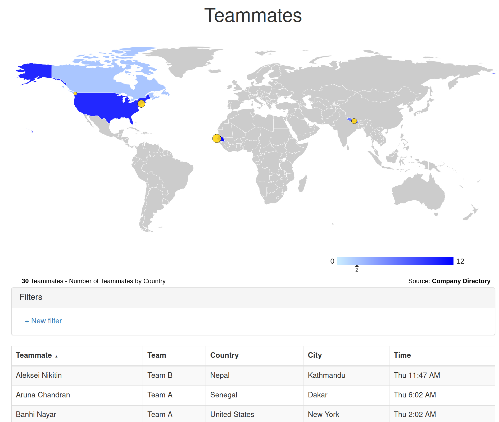

# Teammate Timezones

## Intro

Teammate Timezones is an interactive choropleth map showing where your teammates work in the world. It shows the local time in each location. It uses the open source [MapTable library](https://github.com/Packet-Clearing-House/maptable) to render the map which may be zoomed and filtered. 

To get started, generate a CSV file called `outputFinal.csv` using the format below. Put it into the `html` directory and copy all the files in that directory to your website.

## CSV Format

Teammate Timezones needs a file called `outputFinal.csv` in the `./html/` directory with the following fields:

| Field | Description | Example |
--- | --- | ---
| Teammate | name of the person | Shaffan Fares |
| ISO | 2 letter name in [ISO_3166-1_alpha-2 format](https://en.wikipedia.org/wiki/ISO_3166-1_alpha-2) | CA |
| Country | Full name of country | Canada |
| City | City! | Victoria |
| Descr | Info about the teammate | Loves Cheesemaking! |
| Title | Title at Company | Director of App Services |
| Team | Team! | App Services |
| latitude | latitude! | 14.7319 |
| longitude | longitude! | -17.4572 |
| timezone | Official entry from [Zone.tab](https://en.wikipedia.org/wiki/Zone.tab) | America/Vancouver |

The CSV must have at least the `Teammate` and `ISO` columns to render the choropleth.  It must have the `latitude` and `longitude` to generate a marker.  It must have `timezone` to generate the local time.
 
## CSV Example

| Teammate | ISO | Country | City | Descr | Title | Team | latitude | longitude | timezone |
--- | --- | --- | --- | --- | --- | --- | --- | --- | --- |
| Shaffan Fares | CA | Canada | Victoria | Cheesemaking | Director of App Services | Team A | 48.4283 | -123.3647 | America/Vancouver |
| Majid Saber | SN | Senegal | Dakar | Cheesemaking | App Developer Manager | Team A | 14.7319 | -17.4572 | Africa/Abidjan |
| Ghatiya Iman | SN | Senegal | Dakar | Cheesemaking | Sr App Developer | Team A | 14.7319 | -17.4572 | Africa/Abidjan |

## CSV Generation 

If you don't have a fully formed CSV file already, or have multiple sources of CVS, there's a `clean.sh` script to help you out.  It was developed for a very specific use case which may not apply to you. In order to use it you need:

1. At least one file ending in `.csv` in the `./input/` directory. The file name will be added to each line as the team name (`Team-A.csv` -> "Team A"). It should have 4 columns: `Teammate,Based in,Descr,Title`. `Based in` will be used to search for a lat lon.
1. Optionally have a `sub-cleanse.sh` bash script in `./lookups/` where you can do any manual clean up needed. 
1. Have a `country.city.timezone.offset.csv` file to lookup timezones in

**WARNING** - `clean.sh`  will overwrite the `outputFinal.csv` file.  Use this script with caution!

The `worldcities.csv` file is [CC BY 4.0](https://creativecommons.org/licenses/by/4.0/) from [Simplemaps.com](https://simplemaps.com).  Thanks to them for providing a free version of their [world cities data](https://simplemaps.com/data/world-cities) with a permissive license!

## Sample map 

You can can run sample data through the CSV Generation `clean.sh` script by running the `runSamples.sh` script. It can be good way to get up and running with the lookup files and a map. You can then edit these in place and re-run the `clean.sh` script to re-compile the `outputFinal.csv` file.

**WARNING** - `runSamples.sh`  will overwrite the `outputFinal.csv` , `sub-cleanse.sh` and `country.city.timezone.offset.csv` files.  Use this script with caution!

