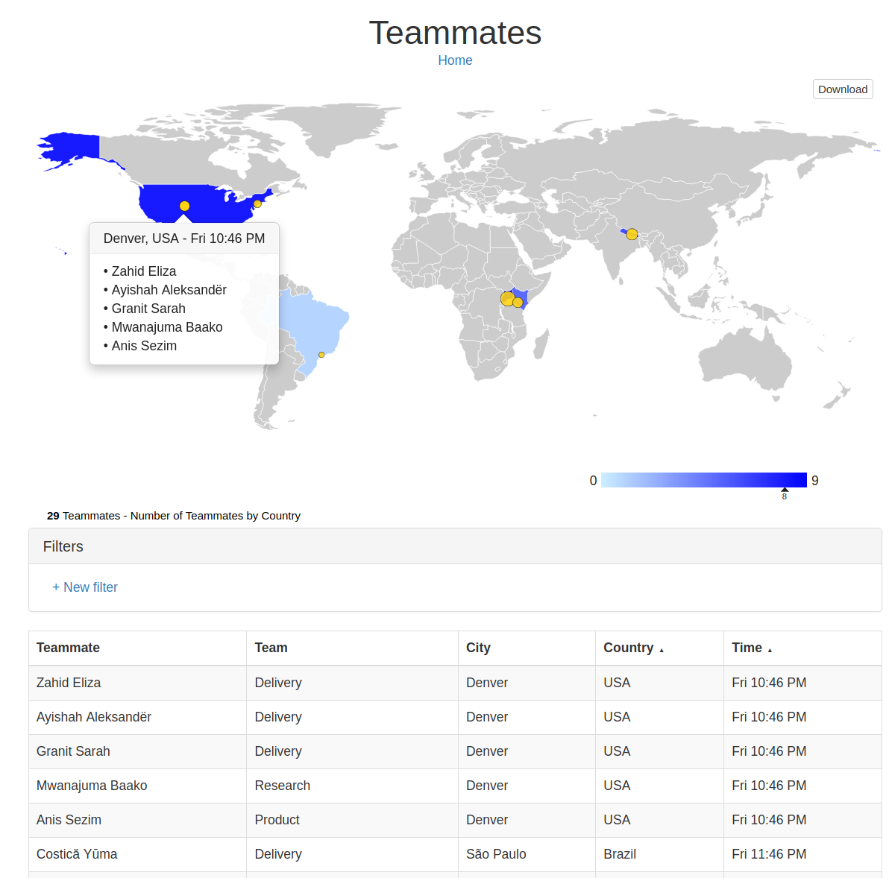

# Teammate Timezones

## Intro

Teammate Timezones is an interactive choropleth map showing where your teammates work in the world. It shows the local time in each location. It uses the open source [MapTable library](https://github.com/Packet-Clearing-House/maptable) to render the map which may be zoomed and filtered. 

As well, you can download print ready SVGs from any map.  These SVGs can be edited in an image editor and each country's color can easily be changed as they're descrete objects.  See an SVG from the [simple map](./simple.sample.svg) or the [full map with markers](./full.sample.svg).

To get started, generate a CSV file called `outputFinal.csv` using the "CSV Format" format below. Put it into the `html` directory and copy all the files in that directory to your website.

## CSV Format

Teammate Timezones needs a file called `outputFinal.csv` in the `./html/` directory with the following fields:

| Field | Description | Example |
--- | --- | ---
| Teammate | name of the person | Shaffan Fares |
| Team | Team! | App Services |
| Title | Title at Company | Director of App Services |
| City | City! | Victoria |
| Country | Full name of country | Canada |
| Hub | Office the teammate is based out of | Dakar |
| latitude | latitude! | 14.7319 |
| longitude | longitude! | -17.4572 |
| iso_a2 | 2 letter name in [ISO_3166-1_alpha-2 format](https://en.wikipedia.org/wiki/ISO_3166-1_alpha-2) | CA |
| timezone | Official entry from [Zone.tab](https://en.wikipedia.org/wiki/Zone.tab) | Africa/Abidjan |

The CSV must have at least the `Teammate` and `ISO` columns to render the choropleth.  It must have the `latitude` and `longitude` to generate a marker.  It must have `timezone` to generate the local time.
 
## CSV Example

| Teammate | Team | Title | City | Country | Hub | latitude | longitude | iso_a2 | timezone |
--- | --- | --- | --- | --- | --- | --- | --- | --- | --- |
Ziauddin Javed | App Services | App Developer | Kampala | Uganda | Kampala | 0.3136 | 32.5811 | UG | Africa/Nairobi
Shakeel Vesa | Product | Senior Software Developer | Nairobi | Kenya | Nairobi | -1.2864 | 36.8172 | KE | Africa/Nairobi
Muhsin Viorica | Delivery | Project Manager | Kampala | Uganda | Kampala | 0.3136 | 32.5811 | UG | Africa/Nairobi
Shahnaz Saliha | Delivery | Project Manager | Kathmandu | Nepal | Kathmandu | 27.7167 | 85.3667 | NP | Asia/Kathmandu
Hamid Lenuța  | Product | Software Developer | Kampala | Uganda | Kampala | 0.3136 | 32.5811 | UG | Africa/Nairobi
Fouad Zakariya | External Affairs | Communications Manager | New York | USA | Distributed | 40.6943 | -73.9249 | US | America/New_York

## CSV Generation 

If you don't have a fully formed CSV file already there's a `clean.py`  script, run with `python3 clean.py`, to help you out.  It was developed for a very specific use case which may not apply to you. In order to use it you need:

1. At least one file ending in `.csv` in the `./input/` directory
1. Has The columns `Teammate`,`Team`,`Title`,`City`,`Country`,`Hub` where `Country` and `City`  will be used to search for a lat lon pair in `worldcities.csv`.
1. Have a `country.city.timezone.offset.csv` file to lookup timezones in `./lookups/`

**WARNING** - `clean.py`  will overwrite the `outputFinal.csv` file.  Use this script with caution!

The `worldcities.csv` file is [CC BY 4.0](https://creativecommons.org/licenses/by/4.0/) from [Simplemaps.com](https://simplemaps.com).  Thanks to them for providing a free version of their [world cities data](https://simplemaps.com/data/world-cities) with a permissive license!

## Sample map 

You can can run sample data through the CSV Generation `clean.py` script by running the `runSamples.sh` script. It can be good way to get up and running with the lookup files and a map. You can then edit these in place and re-run the `clean.sh` script to re-compile the `outputFinal.csv` file.

**WARNING** - `runSamples.sh`  will overwrite the `outputFinal.csv`  and `country.city.timezone.offset.csv` files.  Use this script with caution!

